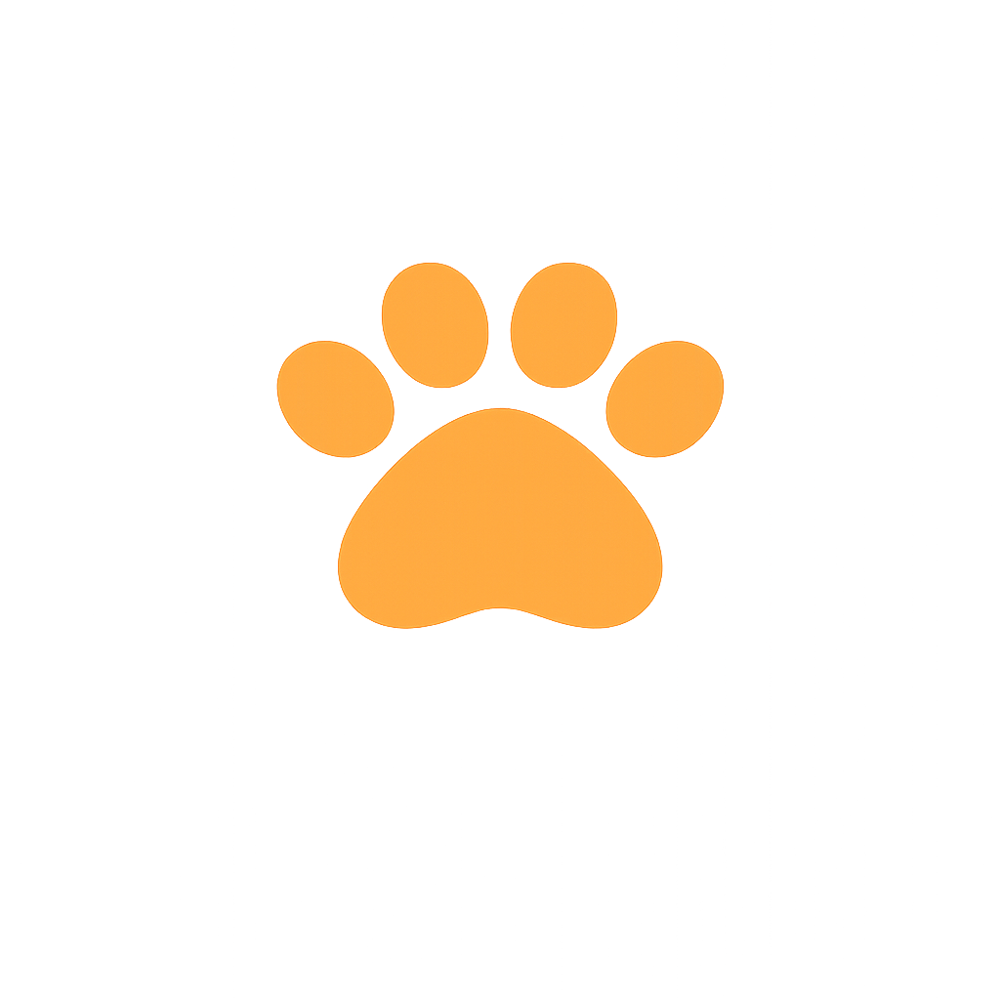

<p align="center">
  
</p>

<h1 align="center">CatClaw</h1>

<p align="center">
  <strong>Privacy-First Local AI Agent Desktop App</strong>
</p>

<p align="center">
  <a href="#features">Features</a> &bull;
  <a href="#why-catclaw">Why CatClaw</a> &bull;
  <a href="#getting-started">Getting Started</a> &bull;
  <a href="#architecture">Architecture</a> &bull;
  <a href="#development">Development</a> &bull;
  <a href="#contributing">Contributing</a>
</p>

<p align="center">
  <a href="https://github.com/huaruic/catclaw/releases"></a>
  <a href="https://github.com/huaruic/catclaw"></a>
  <a href="https://github.com/huaruic/catclaw"></a>
  <a href="https://github.com/huaruic/catclaw/releases"></a>
  <a href="LICENSE"></a>
</p>

<p align="center">
  <a href="https://catclaw.app">Website</a> &bull;
  English &bull;
  <a href="README.zh-CN.md">简体中文</a>
</p>

---

## Overview

CatClaw is a **local AI agent desktop app** powered by [OpenClaw](https://github.com/nicepkg/openclaw). It turns command-line AI orchestration into a beautiful, accessible desktop experience — no terminal required.

Run AI agents locally with full privacy. Chat with multiple LLM providers, manage messaging channels like **WeChat, Feishu/Lark, Telegram, and DingTalk**, schedule automated tasks, and extend agent capabilities with skills — all from a single desktop app that keeps your data on your machine.

CatClaw is an **offline-capable ChatGPT alternative** for users who want powerful AI without cloud dependency.

<!-- 
## Screenshot

<p align="center">
  
</p>
-->

---

## Why CatClaw

Building AI agents shouldn't require mastering the command line. CatClaw makes powerful AI technology accessible through an interface that respects your time and privacy.

| Challenge | CatClaw Solution |
|-----------|-----------------|
| Complex CLI setup | One-click installation with guided setup wizard |
| Configuration files | Visual settings with real-time validation |
| Process management | Automatic runtime lifecycle management |
| Multiple AI providers | Unified provider configuration panel |
| Skill/plugin management | Built-in skill browser and one-click install |
| Channel wiring | Visual multi-channel setup (WeChat, Feishu, Telegram, DingTalk) |

### OpenClaw Inside

CatClaw is built directly on the official [OpenClaw](https://github.com/nicepkg/openclaw) core. The runtime is embedded within the application to provide a seamless "batteries-included" experience. Strict alignment with upstream OpenClaw ensures access to the latest capabilities, stability improvements, and full ecosystem compatibility.

---

## Features

### Zero Configuration

Complete setup — from installation to first AI interaction — through an intuitive graphical interface. No terminal commands, no YAML files, no environment variable hunting. CatClaw is a true **zero-setup local AI desktop**.

### Intelligent Chat Interface

Communicate with AI agents through a modern chat experience. Support for multiple conversations, message history, rich Markdown rendering, and multi-agent routing. Each agent can override its own provider and model settings.

### Multi-Channel Management

Configure and monitor multiple AI messaging channels simultaneously. Each channel operates independently with per-account agent binding.

Supported channels include **WeChat, Feishu/Lark, Telegram, and DingTalk** — manage your AI bots across platforms from a single desktop interface.

### Extensible Skill System

Extend AI agent capabilities with pre-built skills. Browse, install, and manage skills through the integrated skill panel — no package managers required. Skills for document processing, web search, and agent self-improvement are available out of the box.

### Secure Provider Integration

Connect to multiple AI providers — **OpenAI, Anthropic, OpenRouter, Ollama**, and any OpenAI-compatible endpoint. API credentials are stored securely. Automatic provider health checking ensures reliable connections.

### Adaptive Theming

Light mode, dark mode, or system-synchronized themes. CatClaw adapts to your preferences automatically.

---

## Who Is This For

**Everyday Users** — Run a local AI assistant for chat, writing, and daily tasks without technical setup. Your conversations stay private on your machine.

**Developers** — Integrate AI into your workflow with flexible provider configuration, local model support via Ollama, and an extensible skill system. Build and test AI agents locally before deploying.

**Teams & Businesses** — Deploy AI agents across messaging channels (WeChat, Feishu, DingTalk) for customer service, internal automation, and team productivity. Keep sensitive data within your infrastructure.

---

## Getting Started

### System Requirements

- **Operating System**: macOS 11+ (Apple Silicon & Intel) or Windows 10+
- **Memory**: 4 GB RAM minimum (8 GB recommended)
- **Storage**: 1 GB available disk space

### Installation

#### Pre-built Releases (Recommended)

Download the latest release for your platform from the [Releases page](https://github.com/huaruic/catclaw/releases) or visit [catclaw.app](https://catclaw.app).

#### Build from Source

```bash
git clone https://github.com/huaruic/catclaw.git
cd catclaw
npm install
npm run bootstrap
npm run dev
```

For a local macOS test package:

```bash
npm run package:mac:test
```

### First Launch

The setup wizard guides you through:

1. **AI Provider** — Add your API key for OpenAI, Anthropic, or connect a local model via Ollama
2. **Channel Setup** — Optionally connect messaging channels (WeChat, Feishu, etc.)
3. **Verification** — Test your configuration before entering the main interface

---

## Architecture

CatClaw employs a dual-process architecture with an embedded OpenClaw runtime:

```
┌─────────────────────────────────────────────────────┐
│                 CatClaw Desktop App                  │
│                                                      │
│  ┌────────────────────────────────────────────────┐  │
│  │  Electron Main Process                         │  │
│  │  • Window & app lifecycle management           │  │
│  │  • OpenClaw runtime supervision                │  │
│  │  • System integration (tray, notifications)    │  │
│  │  • Provider & channel configuration            │  │
│  └──────────────────┬─────────────────────────────┘  │
│                     │ IPC                             │
│  ┌──────────────────▼─────────────────────────────┐  │
│  │  React Renderer Process                        │  │
│  │  • Component-based UI (React 19)               │  │
│  │  • State management (Zustand)                  │  │
│  │  • Rich Markdown chat rendering                │  │
│  └────────────────────────────────────────────────┘  │
└──────────────────────┬───────────────────────────────┘
                       │ WebSocket / HTTP
┌──────────────────────▼───────────────────────────────┐
│  OpenClaw Gateway (Bundled Runtime)                   │
│  • AI agent orchestration & message routing           │
│  • Multi-channel management (WeChat, Feishu, etc.)   │
│  • Skill/plugin execution environment                 │
│  • Provider abstraction layer                         │
└──────────────────────────────────────────────────────┘
```

### Design Principles

- **Process Isolation** — AI runtime runs in a separate process for UI responsiveness
- **Privacy by Default** — All data stays local; no telemetry, no cloud sync
- **Graceful Recovery** — Built-in reconnect, timeout, and backoff logic
- **Secure Storage** — API keys leverage the OS native keychain

---

## Development

### Tech Stack

| Layer | Technology |
|-------|-----------|
| Runtime | Electron 36+ |
| UI Framework | React 19 + TypeScript |
| Styling | Tailwind CSS + shadcn/ui |
| State | Zustand |
| Build | Vite (electron-vite) + electron-builder |
| Testing | Vitest |
| Animation | Framer Motion |
| Icons | Lucide React |

### Available Commands

```bash
# Development
npm install                # Install dependencies
npm run bootstrap          # Download OpenClaw runtime + Node.js
npm run dev                # Start with hot reload

# Quality
npm run lint               # Run ESLint
npm run typecheck          # TypeScript validation

# Testing
npm test                   # Run unit tests
npm run test:watch         # Run tests in watch mode

# Build & Package
npm run build              # Production build
npm run package:mac        # Package for macOS
npm run package:win        # Package for Windows
```

### Project Structure

```
├── src/
│   ├── main/              # Electron main process
│   │   ├── services/      # Provider, runtime, channel services
│   │   ├── state/         # Runtime state management
│   │   ├── ipc/           # IPC handlers
│   │   └── utils/         # Utilities and logger
│   ├── preload/           # Secure IPC bridge
│   └── renderer/          # React UI
│       ├── components/    # Reusable UI components
│       ├── pages/         # Chat, Settings, Skills, Channels
│       └── stores/        # Zustand stores
├── scripts/               # Bootstrap and packaging helpers
├── resources/             # App icons and tray assets
└── docs/                  # Runbooks and implementation notes
```

---

## Roadmap

- Finish release-grade packaging for macOS and Windows
- Add more messaging channel integrations
- Improve diagnostics, logs, and runtime observability
- Expand onboarding and local model setup guidance
- Harden release signing and notarization workflows
- Linux support

---

## Contributing

See [CONTRIBUTING.md](CONTRIBUTING.md).

## Security

See [SECURITY.md](SECURITY.md).

## License

MIT. See [LICENSE](LICENSE).
